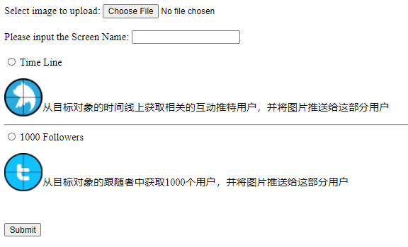

"twflood_php" is used to post tweets automaticly.



Select image file that you want to post.

Input the screenname that you want to flood.

Then there's 2 options, one is from the target's timeline, it will pickup the users from the target's timeline and push the image to these users. Another opertion the tool will pickup 1000 followers from the target and push the image to these followers.

This tools is based on php+twurl+shellscript.
Get twurl from here "https://github.com/twitter/twurl"
before run the tool you need register a twitter developer account and create a project first. If you have multi twitter accounts you can register them on you twitter project by using the twurl.

After that, you need to edit the twconsumerkey.list file by using format "twitter account;consumerkey"

Demo is here: "http://54.189.14.27:8888/" but I removed "twconsumerkey.list" so you can't run it directly anymore.

Don't forget install jq and json-query, I already uploaded the json_query-0.0.2-py2-none-any.whl

After install the json-query need to use vi to edit /usr/local/bin/json-query like following:

```
#!/usr/bin/python
# -*- coding: utf-8 -*-
import re
import sys

from jsonquery.jsonquery import main

if __name__ == '__main__':
    sys.argv[0] = re.sub(r'(-script\.pyw?|\.exe)?$', '', sys.argv[0])
    sys.exit(main())
```
